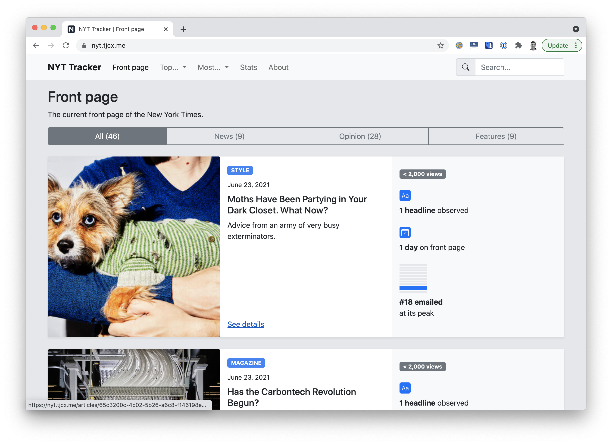

# NYT Scraper

This repo has a variety of tools for collecting and inspecting data from the New York Times website (www.nytimes.com).

## Table of contents

- [Quick start](#quick-start)
- [Directory structure](#directory-structure)
- [Scraping scripts](#scraping-scripts)
- [Web server](#web-server)
- [Cron jobs](#cron-jobs)
- [Postgres database](#postgres-database)

## Quick start

Prerequisites:

- A Postgres database with the correct schema (see [Postgres database](#postgres-database))
- Node 14.5+
- Yarn 1.22+

```
$ git clone https://github.com/tomjcleveland/nyt-scraper.git
$ cd nyt-scraper
$ yarn
$ export PGUSER=nyt_app \
  PGHOST=<HOSTNAME> \
  PGPASSWORD=<PASSWORD> \
  PGDATABASE=nyt \
  PGPORT=5432
$ node crawl.js
```

## Directory structure

Here's a high-level overview of what lives where:

```
├── README.md
├── lib               <-- JS libraries
├── package.json      <-- NodeJS package config
├── public            <-- Static files for website
├── schema.sql        <-- Postgres schema
├── scripts           <-- Scraping scripts
├── server.js         <-- Web server
└── views             <-- HTML templates for website
```

## Scraping scripts

There are three scripts for scraping data from the New York Times and saving it to a database.

### `crawl.js`

- Visits www.nytimes.com
- Collects all headlines on the homepage
- Associates headlines with articles
- Saves headline info to Postgres

### `getPopularity.js`

- Uses the official [NYT API](https://developer.nytimes.com/apis) to fetch article popularity data
- Saves this data to Postgres

### `backfill.js`

- Samples 50 articles from Postgres
- Updates data about this article, including
  - A snapshot of the current article body
  - Updated article metadata (authors, tags, etc.)

## Web server

This repo also contains code for a simple website which can be used to view the article data.



Start the web server like this:

```
$ export PGUSER=nyt_app \
  PGHOST=<HOSTNAME> \
  PGPASSWORD=<PASSWORD> \
  PGDATABASE=nyt \
  PGPORT=5432 \
  BASE_URL=<URL_OF_WEBSITE>
$ node server.js
```

At which point it should be running at http://localhost:3000.

## Cron jobs

Cron jobs are actions that run on a schedule, and most Unix-based systems have it pre-installed.

This project uses several cron jobs.

### Scraping cron jobs

These cron jobs run the scraping scripts on a specified interval, so that we can have time-series data:

```
*/1 * * * * cd /home/ubuntu/nyt-scraper && NODE_ENV=production node crawl.js >> /var/log/nyt/cron.log 2&>1
35 * * * * cd /home/ubuntu/nyt-scraper && NODE_ENV=production node getPopularity.js >> /var/log/nyt/popularity.log 2&>1
49 */1 * * * cd /home/ubuntu/nyt-scraper && NODE_ENV=production node backfill.js >> /var/log/nyt/backfill.log 2&>1
```

### Web server cron jobs

And these cron jobs refresh cached data so that our web server can run more efficiently:

```
*/30 * * * * PGPASSWORD=<PASSWORD> psql -h <HOSTNAME> -U postgres -d nyt -c 'REFRESH MATERIALIZED VIEW CONCURRENTLY nyt.articlestats;' >> /var/log/nyt/psql.log 2&>1
7 */1 * * * PGPASSWORD=<PASSWORD> psql -h <HOSTNAME> -U postgres -d nyt -c 'SELECT refreshSearchIndex();' >> /var/log/nyt/search-index.log 2&>1
```

## Postgres database

All scraped data is written to a Postgres database. The schema for this database is defined in [`schema.sql`](./schema.sql).

Once you have a Postgres server running, you can apply the schema like this (assuming the admin user is `postgres`):

```
$ psql -h <HOSTNAME> -f schema.sql -U postgres
```

You'll also need to add a password for the `nyt_app` user, which your scripts will use to connect to the database:

```
$ psql -h <HOSTNNAME> -U postgres -d nyt
=> ALTER ROLE nyt_app WITH PASSWORD 'mysupersecretpasssword';
```
